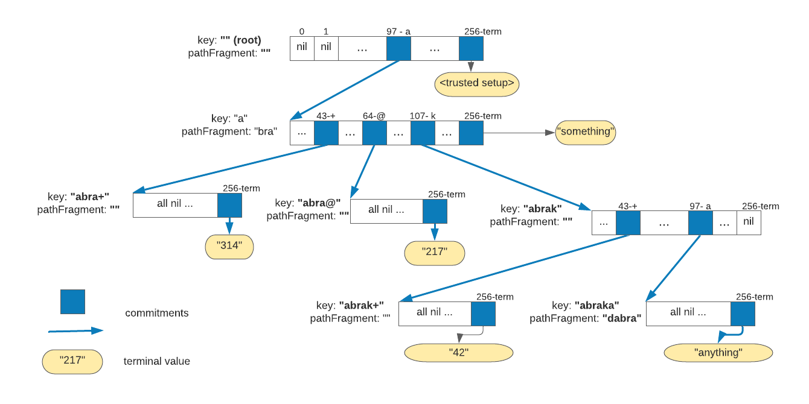
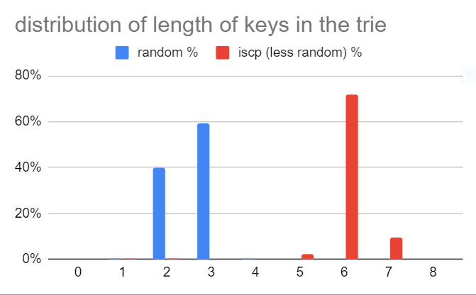

# 257-ary _verkle_ trie

_Disclaimer: the code in this package is experimental. It can only be used in research and not suitable for use in production.  
The _trusted setup_ must be created in a secure environment. This is a responsibility of the user.
The security of your trusted setup entirely depends on how you use the _kzg_setup_ program, i.e. how you treat the secret it is based upon._

## General
The repository contains an **experimental** implementation of the so-called [_verkle tree_](https://math.mit.edu/research/highschool/primes/materials/2018/Kuszmaul.pdf) as a 257-ary [trie](https://en.wikipedia.org/wiki/Trie), a prefix tree.

The implementation uses _polynomial KZG (aka Kate) commitments_ for _vector commitments_ instead of hashing
as a commitment method used in [Merkle trees](https://en.wikipedia.org/wiki/Merkle_tree).
The approach offers significant advantages with regard to performance, specifically data size of data structures.
Please find below references to the extensive literature about _KZG commitments_ and _verkle trees_.

The implementation uses _trusted setup_ completely in Lagrange basis.
Please find here all [math and formulas](https://hackmd.io/@Evaldas/SJ9KHoDJF) as well as references to articles it is based upon.

The implementation uses a bit unconventional approach to the data structure of the trie, the _257-ary trie_.
The rationale for this is always use original keys of arbitrary length without hashing them as in Patricia tries.
Any key can point to the terminal value and be a prefix in other keys.
So, in each node, we need to commit to up to `256` children (max byte value) plus, possibly, to one terminal value, hence `257`.

We see benefits in the approach, due to its properties:

* the trie is wide, so proofs are short.
* use of bytes as child indices makes encoding simpler than in _hexary Patricia trie_.
* keys used in the trie are short
* nodes are reused for commitments to terminal values
* keys are not randomized by hashing, so it represents structure of the state on the chain.
  It makes it possible, for example, to have commitments to partitions of state, say state of one smart contract
  or even one data structure in the state, say an array of a dictionary.
* adding to or updating a key/value pair never deletes keys from the trie, only updates
  a small amount of values and/or adds one new key/value pair.

As it is seen from the implementation, use of 257 instead of more conventional 256 trie does not add any significant overhead.

## Repository and dependencies

The repository contains:
- `kzg` package with the implementation of the _KZG commitments_ and the _trusted setup_.
- `kzg_setup`, the CLI program to create _trusted setups_ and store them into the file.
- `trie` package which contains implementation of the _257-ary trie_ as well as corresponding tests and benchmarks.

The implementation of _KZG commitments_ uses [DEDIS Advanced Crypto Library for Go Kyber v3](https://github.com/dedis/kyber)
and its `bn256` bilinear pairing suite as cryptographic primitives.
The implementation follows formulas presented [in this article](https://hackmd.io/@Evaldas/SJ9KHoDJF).

## Implementation

### The state
The state is assumed to be an arbitrary collection of the key/value pairs.
Empty key (`nil` or `""`) in the implementation is a valid key. The state assumes the empty key always contains  
serialized binary value of the _trusted setup_.

**Determinism of the state**: the state is a set of key/value pairs, i.e. no matter the order of how those key/value pairs were
added to the storage and trie, the state (and the commitment to it) is the same.

The key/value store is and impementation of `trie.KVStore` interface.

The state is implemented as `trie.State`. It contains partitions for key/values pairs of the state, for the trie itself.
It also contains cache for keeping nodes being updated during bulky state update operations.

### The trie

The trie is represented as a collection of key/value pairs in the `trie` partition of the state. Each key/value pair in the trie
represents a _node_ of the trie in serialized form.

``` Go
type Node struct {
	pathFragment  []byte
	children      [256]kyber.Point
	terminalValue kyber.Scalar
}
```

Each node can keep commitments to its children and to terminal value.

The _ith_ child has a commitment to it in `children[i]` or `nil` if there's not commitment to it.
Commitment is represented by `kyber.Point` interface which here is a point on the curve `G1`.

The commitment to the terminal value, if exists, is not `nil` and is equal to the `blake2b` hash of the data itself, adjusted
to the underlying field of the curves. It represented by `kyber.Scalar` interface.

Each _node_ represents a _vector_ `V = (v0, v1, ...., v256)`. Value of `vi` is 0 if value of the underlying
commitment is nil. Otherwise `v256` corresponds to the terminal value and other `vi` are `blke2b` hashes of
commitments adjusted to the field.

Commitment to the node `C` is the commitment to the vector `V`.

The `pathFragment` is a slice (can be empty) of bytes taken from the key of the key/value pair in the state.

Lest say the node `N` is stored in the trie under some key `K`. Concatenation `P = K || N.pathFragment` means the following:
* if `N` contains commitment to the terminal value `V`, the `P` is the key of that value in the state: `P: V`.
* for any not `nil` child with index `0 <= i < 256`, the `Pi = P || {i} = K || N.pathFragment || {i}` is the key of the node
  which contains the _vector_ of commitments of the child. Here `{i}` is a slice of one byte.

So, whenever we need a proof for the key/value pair `K: V` `in the state, we start from the empty key which corresponds to the
root node and then recursively follow the path by concatenating corresponding `pathFragment` values
and picking corresponding byte of the next child in each node. The process finished when we
reach our key and the node with that key with terminal value which is (must be) a commitment to `V.

## Example

Let's say we have the following key/value pairs in the state:
```
        "": <trusted setup>
		"abra": "something"
		"abrakadabra": "anything"
		"abra+": "314"
		"abra@": "217"
		"abra-+" "42"
```

The resulting 257-ary verkle trie will look like this:



## Benchmarks

On _Intel(R) Core(TM) i7-7600U CPU @ 2.80GHz_ laptop.

* building a trie: _0.67 ms_ per included key
* generating proof from the state in memory with 100000 keys: _168 ms per proof of 1 key/value_. It is an expensive
  operation because always require `K x 257` operations on the curve, where `K` is number of nodes in the proof.
* verifying proof (state with 100000 keys): _12.6 ms per verification_

Trie size estimates:

With 100000 key/value pairs in the state generated uniformly randomly with max key size `70`:

* keys/nodes in the trie: _128648_ (excess factor _28%_)
* average length of the key in the trie: _2.6 bytes_
* average number of children in the node: _1.78_
* number of nodes with only terminal values (no children): _98685_ (_76.7%_)
* 96% of nodes has 3 or fewer children
* distribution of length of proofs: _22%_ have length 3, _78%_ have length 4

With 100000 key/value pairs in the state generated with max key size _60_ assuming
realistic state patterns of the state of the IOTA Smart Contract chain: first 4-6 bytes are much more predictable.

* keys/nodes in the trie: _107940_ (excess factor _7%_)
* average length of the key in the trie: _6.07 bytes_
* average number of children in the node: _1.93_
* number of nodes with only terminal values (no children): _98497_ (_91.2%_)
* 96% of nodes has 1 or 2 children
* distribution of length of the proof: _38%_ have length _4_, _49%_ have length _5_, _13%_ have length _6_

Also, the following chart shows size of keys in the trie partition in bytes:

