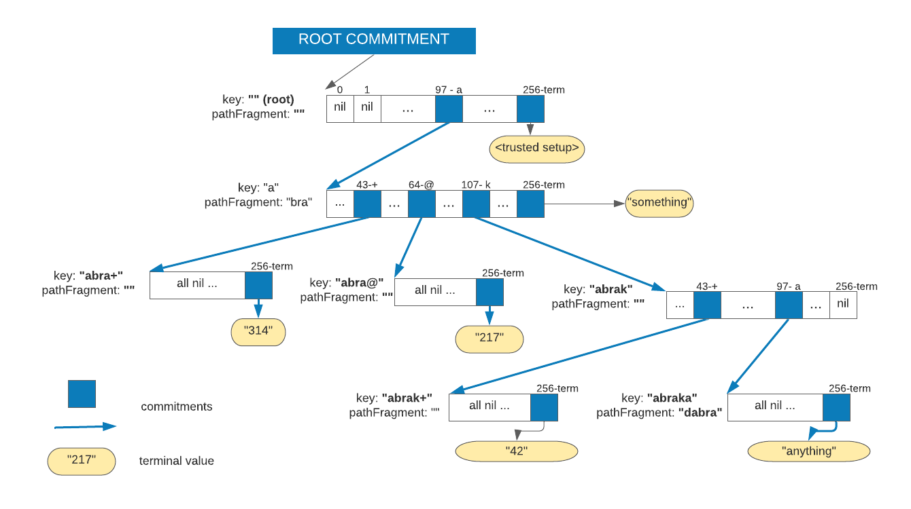

# 257-ary _verkle_ trie

_Disclaimer: the code in this package is experimental. It can only be used in research and is not suitable for use in production.
The trusted setup must be created in a secure environment. This is a responsibility of the user._

## General
The repository contains an implementation of the so-called _verkle tree_ as a 257-ary [trie](https://en.wikipedia.org/wiki/Trie), a prefix tree.
Here's an article explaining [what are verkle trees](https://vitalik.ca/general/2021/06/18/verkle.html). In short, these
are significantly more efficient replacement for [Merkle trees](https://en.wikipedia.org/wiki/Merkle_tree).
_Verkle trees_ uses _polynomial KZG (aka Kate) commitments_ for _vector commitments_ instead of usual hash function.
The approach offers significant advantages.

The implementation uses _trusted setup_ completely in Lagrange basis.
Please find here all [math and formulas](https://hackmd.io/@Evaldas/SJ9KHoDJF) as well as references to the articles it is based upon.

The implementation mostly follows the structure of the [Merkle Patricia Tree](https://eth.wiki/fundamentals/patricia-tree).
Instead of being _hexary_, it commits to 257-long vector in each node:
256 possible values of the byte plus one for an optional commitment to the terminal value in each node.
So constant `d = 257` in the trusted setup, hence the _257-ary trie_.

Original keys of arbitrary length without hashing them to 32 bytes are used to build the trie.
This results in shorter keys, more predictable and slow-changing structure of the trie.
Any key can point to a terminal value and same time it can be a prefix in other keys.
As it is seen from the implementation, the special 257th "character" does not introduce any significant overhead.

## Repository and dependencies

The repository contains:
- `kzg` package with the implementation of the _KZG commitments_ and the _trusted setup_.
- `kzg_setup`, the CLI program to create a _trusted setup_ from a secret and store it into the file.
- `trie` package contains implementation of the _trie_ as well as corresponding tests and benchmarks.

The implementation of _KZG commitments_ uses [DEDIS Advanced Crypto Library for Go Kyber v3](https://github.com/dedis/kyber)
and its `bn256` bilinear pairing suite as cryptographic primitives.
The implementation follows formulas presented [in this article](https://hackmd.io/@Evaldas/SJ9KHoDJF).

## Implementation

### The state
The state is assumed to be an arbitrary collection of the key/value pairs.
Empty key (`nil` or `""`) in the implementation is a valid key. The state assumes the empty key always contains
serialized binary value of the _trusted setup_ upon which the commitments are calculated.
So, you can always check if the root commitment contains the commitment to the _trusted setup_ itself.

**Determinism of the state**: the state is a **set** of key/value pairs, i.e. no matter the order
of how those key/value pairs were added to the storage and trie, the state (and the commitment to it) is the same.

The key/value store is and implementation of `trie.KVStore` interface.

The state is implemented as `trie.State`. It contains partitions for key/values pairs of the state and for the trie itself.
It also contains the cache for keeping nodes being updated during bulky state update operations to make them atomic.

### The trie

The trie is represented as a collection of key/value pairs in the `trie` partition of the state.
Each key/value pair in the trie represents a _node_ of the trie in serialized form.

``` Go
type Node struct {
	pathFragment  []byte
	children      [256]kyber.Point
	terminalValue kyber.Scalar
}
```

Each node can keep commitments to its up to 256 children and to the terminal value as one vector.

The _ith_ child has a commitment to it in `children[i]` or `nil` if there's not commitment to it.
Commitment is represented by `kyber.Point` interface which here is a point on the curve `G1`.

The commitment to the terminal value, if exists, is not `nil` and is equal to the `blake2b` hash of the data itself,
adjusted to the underlying field of the curves. It represented by `kyber.Scalar` interface.

Each _node_ represents a _vector_ `V = (v0, v1, ...., v256)` of length 257. Value of `vi` is 0 if value of the underlying
commitment is `nil`. Otherwise, `v256` corresponds to the terminal value and other `vi` are `blake2b` hashes of
commitments adjusted to the field.

Commitment to the node is the commitment to the vector `V`.

The `pathFragment` is a slice (can be empty) of bytes taken from the key of the key/value pair in the state.

Let's say the node `N` is stored in the trie under the key `K`. Concatenation `P = K || N.pathFragment` means the following:
* if `N` contains commitment to the terminal value `V`, the `P` is the key of that value in the state: `P: V`.
* for any not `nil` child with index `0 <= i < 256`, the `Pi = P || {i} = K || N.pathFragment || {i}` is the key of the node
  with the _vector_ of commitments of the child. Here `{i}` is a slice of one byte with value `i`.

So, whenever we need a proof for the key/value pair `K: V` in the state, we start from the empty key which corresponds to the
root node and then recursively follow the path by concatenating corresponding `pathFragment` values
and picking corresponding byte of the next child in each node. The process is finished when we
reach our key and the corresponding node which contains commitment of the terminal value `V`.

## Example

Let's say we have the following key/value pairs in the state:
```
   "": <trusted setup>
   "abra": "something"
   "abrakadabra": "anything"
   "abra+": "314"
   "abra@": "217"
   "abra-+" "42"
```

The resulting 257-ary verkle trie will look like this:



## Benchmarks

On _Intel(R) Core(TM) i7-7600U CPU @ 2.80GHz_ laptop.

* building a trie: _0.67 ms_ per 1 added key/value pair
* generating proof from the state in memory with 100000 keys: _168 ms per proof of 1 key/value_. It is an expensive
  operation because always requires `K x 257` operations on the curve, where `K` is number of nodes in the proof.
* verifying proof (state with 100000 keys): _12.6 ms per verification_

Trie size estimates:

With 100000 key/value pairs in the state generated uniformly randomly with max key size `70`:

* keys/nodes in the trie: _128648_ (excess factor _28%_)
* average length of the key in the trie: _2.6 bytes_
* average number of children in the node: _1.78_
* number of nodes with only terminal value (no children): _98685_ (_76.7%_)
* 96% of nodes has 3 or fewer children
* distribution of length of proofs: _22%_ have length 3, _78%_ have length 4

With 100000 key/value pairs in the state generated with max key size _60_ assuming
realistic patterns of the state of the IOTA Smart Contract chain: first 4-6 bytes identified partition of the smart contract.

* keys/nodes in the trie: _107940_ (excess factor _7%_)
* average length of the key in the trie: _6.07 bytes_
* average number of children in the node: _1.93_
* number of nodes with only terminal value (no children): _98497_ (_91.2%_)
* 96% of nodes has 1 or 2 children
* distribution of length of the proof: _38%_ have length _4_, _49%_ have length _5_, _13%_ have length _6_

The following chart shows size of keys in the trie partition in bytes:


The keys are very short due to the big width of the tree.

## TODO

* The function to remove a key/value pair from the state is not implemented yet.

##  Links
* [Constant-Size Commitments to Polynomials and Their Applications](https://www.iacr.org/archive/asiacrypt2010/6477178/6477178.pdf),
  the original paper
* [KZG polynomial commitments](https://dankradfeist.de/ethereum/2020/06/16/kate-polynomial-commitments.html) by Dankrad Feist
* [PCS multiproofs using random evaluation](https://dankradfeist.de/ethereum/2021/06/18/pcs-multiproofs.html) by Dankrad Feist
* [Verkle trees](https://vitalik.ca/general/2021/06/18/verkle.html) by Vitalik Buterin
* [Kate Commitments: A Primer](https://hackmd.io/@tompocock/Hk2A7BD6U)
* [DEDIS Advanced Crypto Library for Go Kyber v3](https://github.com/dedis/kyber)
* [Modified Merkle Patricia Trie Specification](https://eth.wiki/fundamentals/patricia-tree)
* [Experimental KZG implementation](https://hackmd.io/@Evaldas/SJ9KHoDJF). Math of this implementation explained in detail

## Acknowledgements
Special thanks to _Dankrad Feist_ for pointing out my crypto-mathematical mistakes